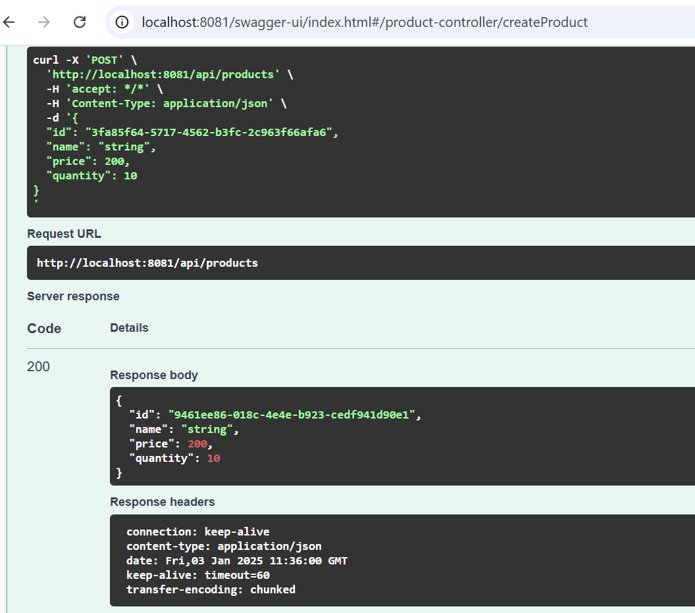
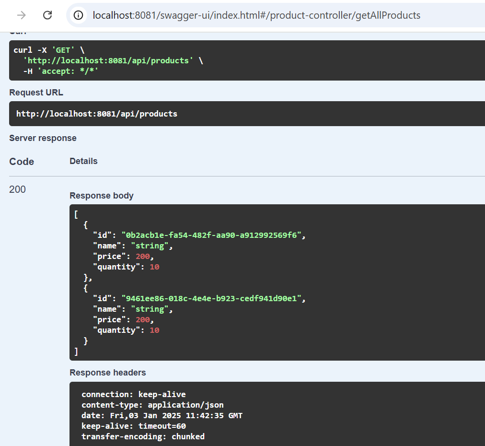
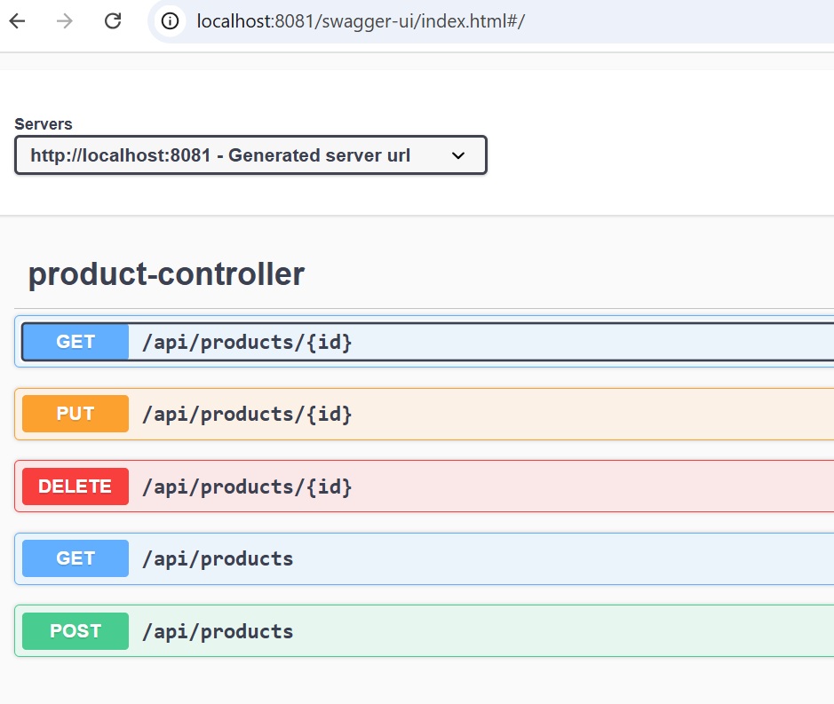
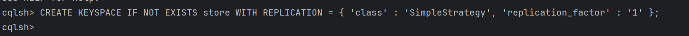

<!DOCTYPE html>
<html lang="fr">
<head>
    <meta charset="UTF-8">
    <meta name="viewport" content="width=device-width, initial-scale=1.0">
    <title>Développement d'une Application Spring Boot pour la Gestion des Produits avec Cassandra</title>
</head>
<body>

    <h1>Développement d'une Application Spring Boot pour la Gestion des Produits avec Cassandra</h1>

    

        Ce projet implémente une application Spring Boot qui interagit avec une base de données Cassandra pour effectuer des opérations CRUD (Create, Read, Update, Delete) sur les produits. Cassandra est utilisé comme système de gestion de base de données NoSQL en raison de ses capacités de scalabilité et de haute disponibilité.
    

    <h2>Exemples d'images</h2>

    <h3>Création d'un produit</h3>
    
    

        Cette image montre probablement l'interface utilisateur ou une illustration liée à la fonctionnalité de création d'un produit dans l'application. Il pourrait s'agir d'un formulaire de création ou de l'ajout d'un produit dans la base de données Cassandra.
    

    <h3>Récupération des produits</h3>
    
    

        Cette image illustre probablement la fonction "Get", c'est-à-dire la récupération des informations d'un produit depuis la base de données. L'image pourrait afficher une réponse à une requête GET ou la liste des produits récupérés.
    

    <h3>Interface Swagger</h3>
    
    

        Swagger est une interface populaire utilisée pour tester les API REST. Cette image pourrait être une capture d'écran de l'interface Swagger qui permet d'interagir avec les endpoints de l'application. Swagger génère automatiquement la documentation des API et permet de tester les différentes opérations CRUD (comme GET, POST, PUT, DELETE).
    

    <h3>Récupération des produits (autre illustration)</h3>
    
    

        Cette répétition de l'image "get.png" pourrait être une erreur, ou peut-être une tentative d'illustrer une autre utilisation de la fonction "GET", comme par exemple la récupération de plusieurs produits ou d'autres cas d'usage similaires.
    

    <h3>Interaction avec Cassandra via cqlsh</h3>
    
    

        Cette image pourrait illustrer l'utilisation de l'outil en ligne de commande <code>cqlsh</code> de Cassandra pour exécuter des requêtes CQL (Cassandra Query Language). Elle montre probablement l'exécution de commandes pour interagir directement avec la base de données Cassandra, comme des insertions ou des sélections de produits.
    

    <h2>Résumé des Concepts et Outils Utilisés</h2>

    <ul>
        <li><strong>Spring Boot</strong> : Framework utilisé pour développer l'application backend, simplifiant la configuration et le développement des services RESTful.</li>
        <li><strong>Cassandra</strong> : Base de données NoSQL utilisée pour stocker les informations des produits. Elle est configurée avec Spring Boot via Spring Data Cassandra pour effectuer les opérations CRUD.</li>
        <li><strong>Swagger</strong> : Outil permettant de tester et documenter les API. Il génère une interface web pour tester facilement les différentes fonctionnalités exposées par votre application.</li>
        <li><strong>CQLSH</strong> : Outil en ligne de commande pour interagir directement avec Cassandra, utile pour gérer les données à travers des requêtes CQL.</li>
    </ul>

    <h2>Conclusion</h2>

    

        Le projet illustre l'utilisation conjointe de Spring Boot et Cassandra pour créer une application de gestion des produits. Les images mentionnées servent à illustrer les différentes fonctionnalités de l'application, comme la création et la récupération de produits, l'utilisation de Swagger pour tester les API, et l'interaction avec la base de données Cassandra via des outils comme <code>cqlsh</code>. Ce processus fournit une solution robuste et scalable pour gérer des produits dans un environnement de production.
    

</body>
</html>
